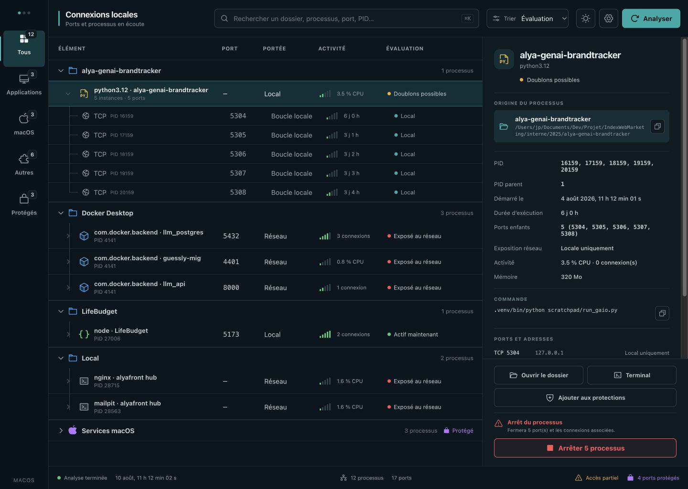

# PortRoot

**Chaque port, jusqu’à sa racine.** PortRoot est une application desktop pour comprendre quels ports sont ouverts, retrouver les projets qui les ont lancés et arrêter les processus oubliés sans toucher aux services protégés.



## Fonctionnalités

- Inventaire des ports TCP en écoute et des sockets UDP pertinentes.
- Relation dossier ou application → famille de processus → PID → ports.
- Portée claire : boucle locale ou toutes les interfaces réseau.
- Métadonnées : exécutable, commande, dossier de travail, parent, démarrage, durée, CPU, mémoire et connexions actives.
- Détection des familles de processus dupliquées dans un même projet.
- Identification des ports publiés par les conteneurs Docker actifs, avec leur nom et leur ID exact.
- Recherche, catégories, tri, arborescence repliable et inspecteur détaillé.
- Ouverture du dossier dans le gestionnaire de fichiers ou dans un terminal natif.
- Arrêt gracieux d’un ou plusieurs processus avec confirmation et vérification anti-réutilisation de PID.
- Arrêt ciblé d’un conteneur Docker avec `docker stop`, sans envoyer de signal au moteur partagé de Docker Desktop.
- Protections persistantes par système, port, nom de processus ou préfixe de chemin.
- Thèmes sombre, clair et système.

## Sécurité

L’interface n’est pas la barrière de sécurité. Avant chaque arrêt de processus, le moteur Rust :

1. vérifie que le PID existe encore;
2. compare son heure de démarrage pour détecter une réutilisation du PID;
3. relit les ports actuellement détenus;
4. applique de nouveau toutes les règles de protection;
5. bloque toujours le PID 1 et les services système protégés.

Pour un conteneur Docker, PortRoot transporte l’ID Docker exact depuis l’analyse, relit les ports et protections associés, vérifie à nouveau l’identité avec Docker, exécute `docker stop`, puis confirme que le conteneur n’est plus actif. Le PID commun de `com.docker.backend` n’est jamais utilisé comme cible du conteneur.

L’application n’exige pas `sudo`. Selon les permissions de la plateforme, certains propriétaires de sockets peuvent rester masqués; ce cas est signalé dans l’interface.

## Stack

- Tauri 2
- Rust
- React 19 + TypeScript
- Vite
- Phosphor Icons
- `netstat2` pour l’inventaire cross-platform
- `sysinfo` pour les métadonnées et actions de processus

## Développement

Prérequis : Node.js, npm, Rust et les dépendances système de Tauri pour la plateforme cible.

```bash
npm install
npm run tauri dev
```

Le serveur Tauri de développement utilise le port `1420` afin d’éviter les collisions avec les serveurs Vite habituels sur `5173`.

Pour vérifier séparément l’interface :

```bash
npm run dev -- --port 4173 --strictPort
```

Le mode navigateur utilise des données de démonstration réalistes et désactive les actions d’arrêt réelles. Le scan système et les arrêts sont activés uniquement dans la fenêtre Tauri.

## Vérification

```bash
npm run build
npm run test:web
cargo test --manifest-path src-tauri/Cargo.toml
cargo run --manifest-path src-tauri/Cargo.toml --example scan_summary
```

## Compilation de l’application

```bash
npm run tauri build
```

La configuration contient les commandes adaptées à macOS, Windows et Linux. La matrice GitHub Actions compile et teste les trois plateformes, puis exécute leur scanner natif. La version actuelle a été compilée et vérifiée localement sur macOS; les contrôles manuels Windows et Linux décrits dans [`CROSS_PLATFORM_TEST_PLAN.md`](CROSS_PLATFORM_TEST_PLAN.md) restent requis avant publication.

Le bundle macOS local utilise une signature ad hoc. Une diffusion publique sans avertissement Gatekeeper nécessitera un certificat Developer ID et une notarisation Apple.

## Structure

- `src/` — interface, thèmes, filtres, arborescence et dialogues.
- `src-tauri/src/scanner.rs` — sockets, processus, Docker, portée et activité.
- `src-tauri/src/actions.rs` — ouverture dossier/terminal et arrêt sécurisé.
- `src-tauri/src/settings.rs` — persistance et évaluation des protections.
- `design/reference-dark.png` — direction visuelle retenue.
- `design-qa.md` — comparaison et vérification visuelle.

## Limites connues

- UDP ne possède pas d’état `LISTEN` universel. Le scanner exclut les endpoints UDP réseau manifestement éphémères pour éviter de présenter le trafic sortant comme un service entrant.
- Les chemins, commandes et PIDs peuvent être masqués par le système pour des processus appartenant à un autre utilisateur.
- L’arrêt forcé est supporté par le moteur mais n’est volontairement pas exposé dans l’interface initiale.
- L’icône finale, la licence et la signature de distribution restent à décider avant une publication GitHub.
