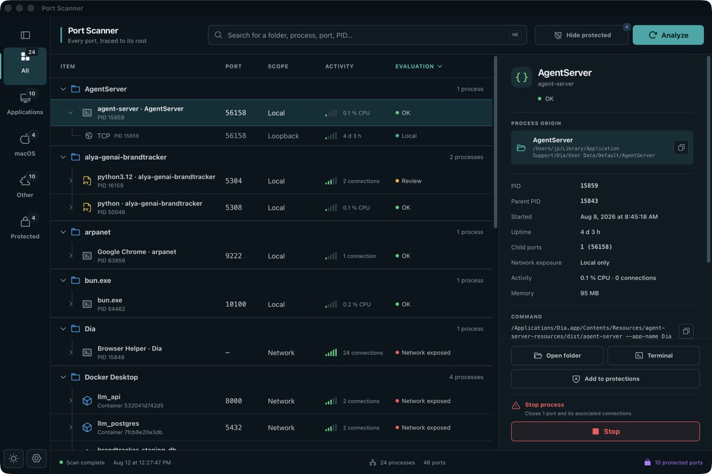

<div align="center">
  
  <h1>Port Scanner</h1>
  <p><strong>Every port, traced to its root.</strong></p>
  <p>
    A local-first desktop utility that turns open ports into an understandable map of<br>
    projects, processes, containers, and system services.
  </p>
  <p>
    macOS · Windows · Linux &nbsp;|&nbsp; English · Français &nbsp;|&nbsp; Dark · Light · System
  </p>
</div>

<p align="center">
  
</p>

Port Scanner helps developers understand what is still running on their machine. Instead of showing an anonymous socket table, it traces each discoverable listener back through its process, application, Docker container, and working directory.

Use it to find forgotten development servers, review network exposure, confirm duplicate processes, protect critical services, and safely stop work that no longer belongs in the background.

## Why Port Scanner?

Modern development environments accumulate state quickly: local APIs, Vite servers, Python workers, databases, browser helpers, Docker containers, and tools launched from terminals that were closed hours ago.

Port Scanner turns that state into a relationship-first tree:

```text
Project or application
└── Process family
    ├── Process instance / Docker container
    └── Listening TCP and bound UDP ports
```

The result answers the questions that raw tools such as `lsof`, `netstat`, or `ss` leave to you:

- Which project opened this port?
- Is it local-only or exposed to the network?
- Is this another instance of the same server or a managed worker?
- Can it be stopped safely?
- Which process or container should be targeted?

## Highlights

### Trace ports back to their origin

- Discover listening TCP sockets and relevant bound UDP sockets.
- Group ports by application, working folder, process family, and Docker container.
- Inspect the PID, parent PID, executable, command, working directory, start time, uptime, CPU, memory, and active connections when the operating system exposes them.
- Distinguish loopback-only listeners from ports bound to network interfaces.

### Find the signal in a busy workstation

- Search by folder, process, port, PID, command, or address.
- Filter Applications, System services, Other processes, and Protected processes.
- Hide protected processes from the **All** view without changing their protection rules.
- Sort directly from the Item, Port, Scope, Activity, and Evaluation columns.
- Collapse projects, process families, and child ports without losing context.

### Understand duplicates before stopping them

Port Scanner compares the executable, working directory, normalized command, listener ports, process relationships, and runtime ownership before assigning a duplicate status.

- **Confirmed duplicates** are independent processes launching the same normalized command from the same folder.
- **Possible duplicates** share an origin but do not provide enough matching metadata for certainty.
- **Managed processes** belong to a worker family or intentionally share a listener.

Confirmed groups can be stopped entirely, or cleaned up while keeping one explicitly selected instance running.

### Manage Docker containers precisely

Published Docker ports are associated with the exact container name and ID. Stopping a container calls `docker stop` for that container rather than sending a signal to Docker Desktop's shared backend process.

### Work from the process context

- Reveal the working directory in the native file manager.
- Open a terminal directly in that directory.
- Copy paths and commands from the inspector.
- Switch between English and French.
- Use dark, light, or system appearance modes.

## Safety by design

The interface is not the security boundary. Before every stop request, the Rust engine:

1. verifies that the target PID or Docker container still exists;
2. compares the process start time to detect PID reuse;
3. reads the ports currently owned by the target;
4. reapplies every protection rule;
5. blocks PID 1 and protected system services;
6. stops only the confirmed target.

Protection rules can target:

- operating-system services;
- ports;
- process names;
- executable or working-directory paths;
- exact Docker container names.

Custom protections are reversible. If a protection rule covers several processes, Port Scanner shows the full process and port impact before removing it. Removing a protection never stops a process.

> Port Scanner does not require `sudo`. Some process owners, paths, or commands may remain hidden by the operating system; partial visibility is reported instead of being treated as a complete scan.

## Project status

Port Scanner is currently a pre-release `0.1.0` project.

| Platform | Status |
| --- | --- |
| macOS Apple Silicon | Built, scanned, tested, ad-hoc signed, and packaged as a DMG locally |
| Windows | Automated build and scanner checks configured; manual validation pending |
| Ubuntu 22.04 | Automated build and scanner checks configured; manual validation pending |

The application is local-first and requires no account or cloud backend. Publicly signed installers and GitHub Releases are not available yet.

## Tech stack

- [Tauri 2](https://tauri.app/) for the desktop shell and native bridge
- Rust for scanning, process metadata, protection enforcement, and stop actions
- React 19 and TypeScript for the interface
- Vite for the frontend toolchain
- Phosphor Icons for the icon system
- `netstat2` for cross-platform socket discovery
- `sysinfo` for process metadata and lifecycle actions

## Run from source

### Prerequisites

- Node.js and npm
- Rust stable — the native package declares Rust `1.77.2` as its minimum version
- The Tauri 2 system dependencies for your operating system
- Docker CLI, only if you want Port Scanner to identify and stop Docker containers

### Install and launch

```bash
npm ci
npm run tauri dev
```

The Tauri development window uses port `1420` to avoid colliding with the Vite servers commonly running on `5173`.

### Interface-only preview

```bash
npm run dev -- --port 4173 --strictPort
```

The browser preview uses realistic sample data and disables native stop actions. Real socket scanning and process management are available only inside the Tauri application.

## Build

```bash
npm run tauri build
```

On macOS, the local build produces an application bundle and a DMG under:

```text
src-tauri/target/release/bundle/
```

The current macOS build uses an ad-hoc signature. Public distribution without a Gatekeeper warning will require an Apple Developer ID certificate and notarization.

## Test and validate

```bash
npm run typecheck
npm run test:web
npm run build
cargo test --manifest-path src-tauri/Cargo.toml
cargo run --manifest-path src-tauri/Cargo.toml --example scan_summary
```

The GitHub Actions workflow targets macOS, Windows, and Ubuntu. The full manual release checklist lives in [`CROSS_PLATFORM_TEST_PLAN.md`](CROSS_PLATFORM_TEST_PLAN.md).

## Repository structure

| Path | Responsibility |
| --- | --- |
| `src/` | React interface, themes, filters, process tree, inspector, and confirmation dialogs |
| `src/lib/processTree.ts` | Project/process grouping, evaluation, sorting, and duplicate analysis |
| `src-tauri/src/scanner.rs` | Socket inventory, process enrichment, scope detection, and activity |
| `src-tauri/src/docker.rs` | Docker container discovery and published-port association |
| `src-tauri/src/actions.rs` | Native folder/terminal actions and protected process/container shutdown |
| `src-tauri/src/settings.rs` | Persistent settings and backend protection evaluation |
| `tests/` | TypeScript unit tests for grouping, duplicates, protections, actions, and localization |
| `design/` | Visual direction and implementation QA references |

## Known limitations

- UDP does not provide a universal `LISTEN` state. Port Scanner excludes clearly ephemeral connected UDP endpoints to avoid presenting outbound traffic as an inbound service.
- Process paths, commands, and PIDs can be hidden for processes owned by another user or restricted by the operating system.
- Forced termination is supported by the native engine but is intentionally not exposed in the current interface.
- Windows and Linux still require the manual validation documented in the cross-platform test plan before a public release.

## License

Port Scanner is released under the [MIT License](LICENSE).

Copyright © 2026 Jean-Philippe Lefebvre.
